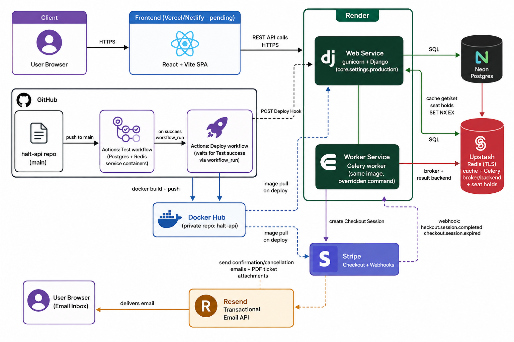

<div align="center">

# Halt API

**A scalable Bus Booking REST API**

Built with Django, Django REST Framework, PostgreSQL, Redis, Celery, Stripe, Resend, JWT Authentication, Docker, GitHub Actions, and Render.


</div>

---

## Table of Contents

- [Overview](#overview)
- [Live Deployment](#live-deployment)
- [Features](#features)
- [Tech Stack](#tech-stack)
- [Architecture](#architecture)
- [Project Structure](#project-structure)
- [Authentication Flow](#authentication-flow)
- [Booking Flow](#booking-flow)
- [API Documentation](#api-documentation)
- [Environment Variables](#environment-variables)
- [Installation](#installation)
- [Docker](#docker)
- [Testing](#testing)
- [CI/CD](#cicd)
- [Roadmap](#roadmap)
- [Author](#author)

---

## Overview

Halt is a scalable Bus Booking REST API built with Django and Django REST Framework.

The project follows a service-oriented architecture that separates business logic into services, serializers, and views for better maintainability, scalability, and testability.

Halt includes authentication, bus and route management, trip search, seat availability, booking workflows, payments, transactional email, Redis caching, Celery background tasks, Docker containerization, CI/CD, and production deployment.

---

## Live Deployment

The API is deployed on **Render** using Gunicorn as the production application server.

### Production API

https://halt-api.onrender.com

### API Documentation

https://halt-api.onrender.com/api/docs/

---

## Features

### Authentication

- User registration
- Email OTP verification
- JWT authentication
- Login and logout
- JWT token blacklisting
- Forgot password
- Password reset
- Login attempt rate limiting
- Redis-based OTP storage
- Custom user model

### Bus Management

- Cities
- Operators
- Routes
- Buses
- Trips
- Trip search
- Trip details
- Seat availability

### Booking System

- Seat availability validation
- Seat selection
- Booking creation
- Booking cancellation
- Booking history
- Booking reference generation
- Seat validation
- Booking status handling

### Payments

- Stripe Payment Intents
- Stripe Webhooks
- Payment status handling
- Payment integration with booking workflow

### Email

- Resend email integration
- OTP verification emails
- Password reset emails
- Transactional emails
- Email attachments

### Performance

- Redis-based caching
- Cached trip search
- Optimized database queries
- `select_related()` for related-object optimization
- Celery background tasks

### Security

- Custom user model
- Password hashing
- Django password validators
- JWT authentication
- JWT token blacklisting
- Environment-based configuration
- Login attempt rate limiting
- Secrets managed through environment variables

### Production

- Gunicorn production server
- Docker configuration
- Dockerfile
- `.dockerignore`
- Entrypoint script
- PostgreSQL production database
- Render deployment
- GitHub Actions CI/CD

---

## Tech Stack

| Category          | Technology            |
| ----------------- | --------------------- |
| Language          | Python 3.14           |
| Framework         | Django 5.x            |
| API               | Django REST Framework |
| Database          | PostgreSQL            |
| Cache             | Redis                 |
| Task Queue        | Celery                |
| Authentication    | SimpleJWT             |
| Email             | Resend                |
| Payments          | Stripe                |
| Production Server | Gunicorn              |
| Containerization  | Docker                |
| CI/CD             | GitHub Actions        |
| Deployment        | Render                |
| API Testing       | Bruno / Postman       |

---

## Architecture



---

## Project Structure

```text
halt-api/
├── src/
│   ├── authentication/
│   ├── bookings/
│   ├── buses/
│   ├── cities/
│   ├── operators/
│   ├── routes/
│   ├── trips/
│   ├── core/
│   │   ├── cache/
│   │   ├── constants/
│   │   └── settings.py
│   │
│   └── manage.py
│
├── docs/
├── Dockerfile
├── .dockerignore
├── entrypoint.sh
├── requirements.txt
├── .env.example
├── .gitignore
└── README.md
```

The application is organized into Django apps based on domain responsibilities.

Business logic is separated into service layers instead of placing complex operations directly inside views.

---

## Authentication Flow

```text
Register
   │
   ▼
Generate OTP
   │
   ▼
Store OTP in Redis
   │
   ▼
Send OTP with Resend
   │
   ▼
Verify OTP
   │
   ▼
Activate Account
   │
   ▼
Login
   │
   ▼
Generate JWT Tokens
   │
   ▼
Protected APIs
```

### Password Reset Flow

```text
Forgot Password
      │
      ▼
Generate Reset Token
      │
      ▼
Send Reset Email
      │
      ▼
Validate Token
      │
      ▼
Set New Password
```

---

## Booking Flow

```text
Search Trip
    │
    ▼
View Trip
    │
    ▼
Check Seat Availability
    │
    ▼
Select Seats
    │
    ▼
Validate Seats
    │
    ▼
Create Booking
    │
    ▼
Reserve Seats
    │
    ▼
Create Payment Intent
    │
    ▼
Stripe Payment
    │
    ▼
Stripe Webhook
    │
    ▼
Update Payment Status
    │
    ▼
Booking Confirmed
```

---

## API Documentation

Interactive API documentation is available through Swagger/OpenAPI.

### Swagger

https://halt-api.onrender.com/api/docs/

Documentation is also maintained in the [`docs/`](./docs) directory.

The documentation covers:

- Authentication
- Cities
- Operators
- Routes
- Buses
- Trips
- Bookings
- Payments

---

## Environment Variables

Create a `.env` file in the project root.

```env
SECRET_KEY=
DEBUG=True

DB_NAME=
DB_USER=
DB_PASSWORD=
DB_HOST=
DB_PORT=

REDIS_URL=

RESEND_API_KEY=
RESEND_FROM_EMAIL=

STRIPE_SECRET_KEY=
STRIPE_WEBHOOK_SECRET=

LOGIN_ATTEMPT_LIMIT=5
LOGIN_ATTEMPT_TIMEOUT=300

OTP_TIMEOUT=300
FORGOT_TOKEN_TIMEOUT=900
```

> Never commit `.env` or production secrets to Git.

For production, use secure environment variables provided by the deployment platform.

---

## Installation

### Clone the Repository

```bash
git clone <repository-url>
cd halt-api
```

### Create Virtual Environment

```bash
python -m venv .venv
```

### Activate Virtual Environment

#### Linux / macOS

```bash
source .venv/bin/activate
```

#### Windows

```powershell
.venv\Scripts\activate
```

### Install Dependencies

```bash
pip install -r requirements.txt
```

### Configure Environment Variables

Create a `.env` file based on `.env.example`.

```bash
cp .env.example .env
```

Configure the required Django, PostgreSQL, Redis, Resend, and Stripe settings.

### Run Migrations

```bash
cd src
python manage.py migrate
```

### Start Development Server

```bash
python manage.py runserver
```

The development server will be available at:

```text
http://127.0.0.1:8000/
```

---

## Docker

Halt includes Docker configuration for containerized deployment.

### Docker Files

```text
Dockerfile
.dockerignore
entrypoint.sh
```

### Build Image

```bash
docker build -t halt-api .
```

### Run Container

```bash
docker run --env-file .env -p 8000:8000 halt-api
```

Gunicorn is used as the production application server.

The container entrypoint handles the required application startup tasks before launching the production server.

---

## Testing

API testing can be performed using:

- Bruno
- Postman
- Insomnia
- cURL
- Thunder Client

Run Django tests with:

```bash
cd src
python manage.py test
```

The project also uses automated testing through GitHub Actions.

---

## CI/CD

GitHub Actions is used for automated development workflows.

The CI pipeline validates changes before deployment.

Typical workflow:

```text
Git Push
   │
   ▼
GitHub Actions
   │
   ▼
Install Dependencies
   │
   ▼
Run Tests
   │
   ▼
Build / Validation
   │
   ▼
Render Deployment
```

---

## Roadmap

- [x] Authentication
- [x] Email OTP verification
- [x] Redis integration
- [x] Celery integration
- [x] Resend email integration
- [x] Email attachments
- [x] Stripe payments
- [x] Stripe webhooks
- [x] Ticket generation
- [x] Gunicorn
- [x] Docker configuration
- [x] CI/CD
- [x] Production deployment
- [x] Trip search
- [x] Seat availability
- [x] Booking workflow
- [ ] Pagination
- [ ] Filtering
- [ ] Notifications
- [ ] Monitoring and logging

---

## Author

**Arun**

Software Engineer

Backend-focused developer working with Python, Django, REST APIs, PostgreSQL, Redis, Docker, CI/CD, and cloud deployment.

---

<div align="center">

**Built with Django & Django REST Framework**

</div>
